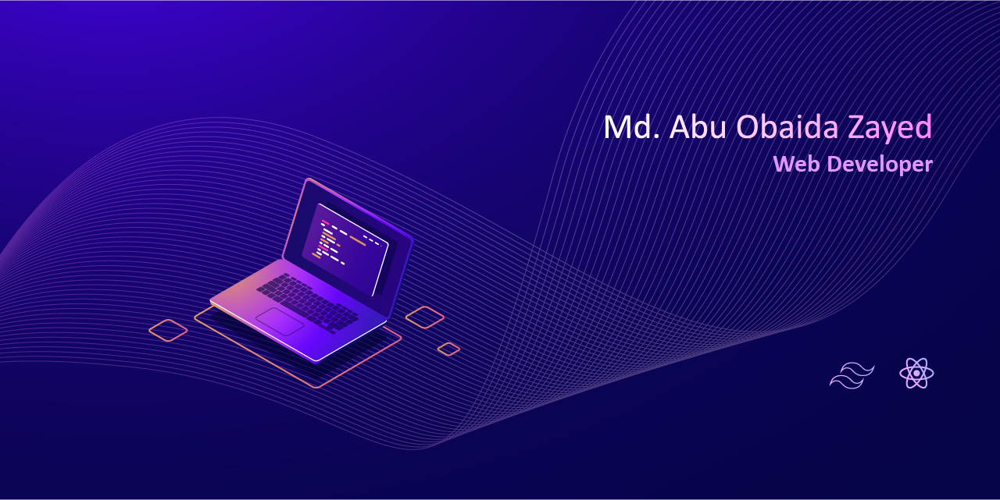

<!-- ### Hi there 👋 -->

- 🌱 I’m currently learning **nextjs and mongoose**, 
- 💬 Ask me about **anything**
- 📫 How to reach me: **abuobaidazayed@gmail.com**
- 😄 Pronouns: he/him
- ⚡ Fun fact: **I can sing Nasheed**

 

## :chart_with_upwards_trend: Current Status

 

 

## :mailbox: Connect with me

 

## :computer: Technologies I use

 

## :tools: Tools I use

<!-- Here are some ideas to get you started:

- 🔭 I’m currently working on ...
- 🌱 I’m currently learning ...
- 👯 I’m looking to collaborate on ...
- 🤔 I’m looking for help with ...
- 💬 Ask me about ...
- 📫 How to reach me: ...
- 😄 Pronouns: ...
- ⚡ Fun fact: ... -->

